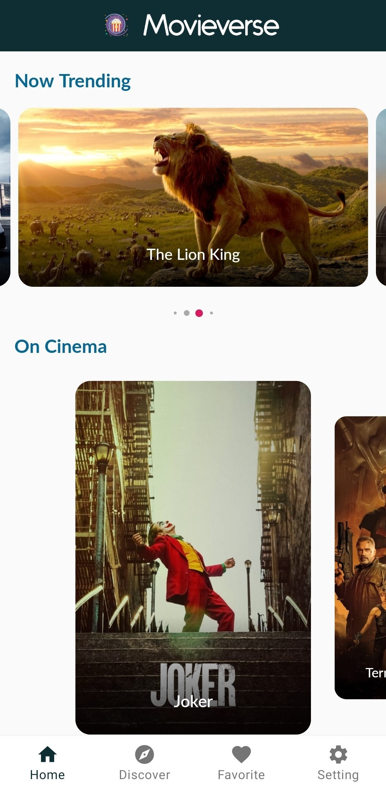
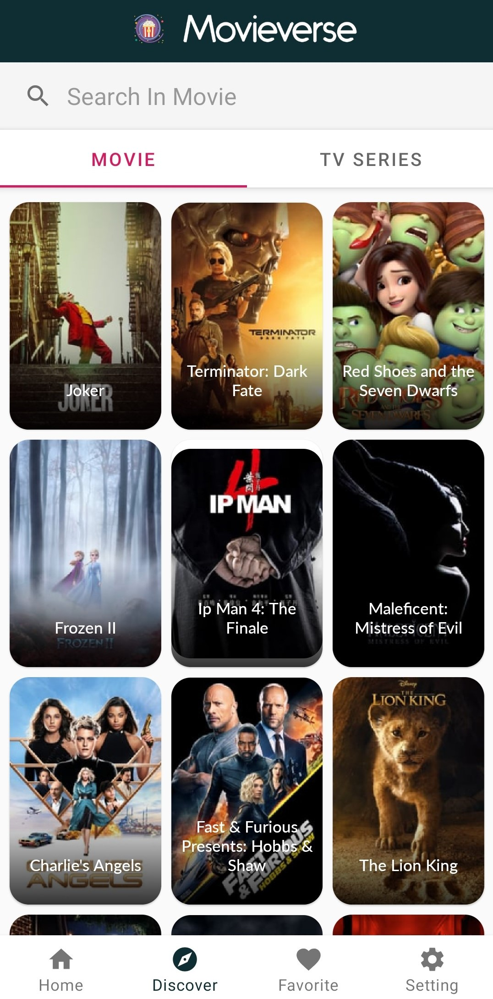

# Movieverse
Movieverse is a movie catalogue Android app, written in Kotlin and using Android <a href='https://developer.android.com/jetpack'>Jetpack</a>
Library such as Navigation, Room, ViewModel, Paging and LiveData. This app also using Kotlin <a href='https://github.com/Kotlin/kotlinx.coroutines'>Coroutine</a> to perform asyncronous operation and using <a href='https://square.github.io/retrofit/'>Retrofit</a> to communicate to REST API. This app is developed in order to complete <a href='https://www.dicoding.com/academies/14'>Menjadi Android Developer Expert</a>, a <a href='https://www.dicoding.com/'>Dicoding</a> picodiploma course.

## Preview
<p float="left">
  
  
  
</p>

## Prerequisites

In order to make app works, you need <a href='https://developers.google.com/youtube/v3/getting-started'>Youtube API</a>, <a href='https://tech.yandex.com/translate/'>Yandex API</a> and <a href='https://www.themoviedb.org/documentation/api'>TheMovieDatabase API</a> Key. 

In your build.gradle(app) :

Change:

```xml
...
def apiPropertiesFile = rootProject.file("api.properties")		//Remove This
def apiProperties = new Properties()							//Remove This
apiProperties.load(new FileInputStream(apiPropertiesFile))		//Remove This

android {
	defaultConfig {
		...
		buildConfigField("String", "TMDB_API_KEY", apiProperties["TMDB_API_KEY"])
		buildConfigField("String", "YANDEX_API_KEY", apiProperties["YANDEX_API_KEY"])
		buildConfigField("String", "GOOGLE_YOUTUBE_API", apiProperties["GOOGLE_YOUTUBE_API"])
		...
	}
}
...
```

Into :

```xml
...
android {
	defaultConfig {
		...
		buildConfigField("String", "TMDB_API_KEY", "\"YOUR_TMDB_API_KEY\"")
		buildConfigField("String", "YANDEX_API_KEY", "\"YOUR_YANDEX_API_KEY\"")
		buildConfigField("String", "GOOGLE_YOUTUBE_API", "\"YOUR_YOUTUBE_API_KEY\"")
		...
	}
}
...
```

For Example :

```xml
...
android {
	defaultConfig {
		...
		buildConfigField("String", "TMDB_API_KEY", "\"123456789\"")
		buildConfigField("String", "YANDEX_API_KEY", "\"ABCDEFG\"")
		buildConfigField("String", "GOOGLE_YOUTUBE_API", "\"123ABC\"")
		...
	}
}
...
```

## Built With

<pre>
<a href='https://developer.android.com/jetpack'>Android Jetpack</a> - Room, Navigation, Paging, LiveData etc.
<a href='https://github.com/google/gson'>Gson</a> - A Java serialization/deserialization library to convert Java Objects into JSON and back.
<a href='https://github.com/bumptech/glide'>Glide</a> - An image loading and caching library for Android focused on smooth scrolling.
<a href='https://github.com/vinc3m1/RoundedImageView'>RoundedImageView</a> - A fast ImageView that supports rounded corners, ovals, and circles.
<a href='https://square.github.io/retrofit/'>Retrofit</a> - A type-safe HTTP client for Android and Java.
<a href='https://github.com/facebook/shimmer-android'>Facebook Shimmer</a> - An easy, flexible way to add a shimmering effect to any view in an Android app.
<a href='https://github.com/IslamKhSh/CardSlider'>CardSlider</a> - Android Card Slider
<a href='https://github.com/yarolegovich/DiscreteScrollView'>DiscreteScrollView</a> - A scrollable list of items that centers the current element and provides easy-to-use APIs for cool item animations.
</pre>

## Author

Nandra Saputra
* <a href='https://www.instagram.com/nandrasptr/'>@nandrasptr</a> on Instagram
* <a href='https://www.linkedin.com/in/nandra-saputra-b90b78157/'>LinkedIn</a> Account

## Download Application - APK File
This app require Android 5.0 - Lolipop or higher to run, <a href='http://www.bit.ly/MovieverseNandra'>Download Link</a>

## License

Apache 2.0. See the <a href='https://github.com/nandrasaputra/Movieverse/blob/master/LICENSE'>LICENSE</a> file for details.
